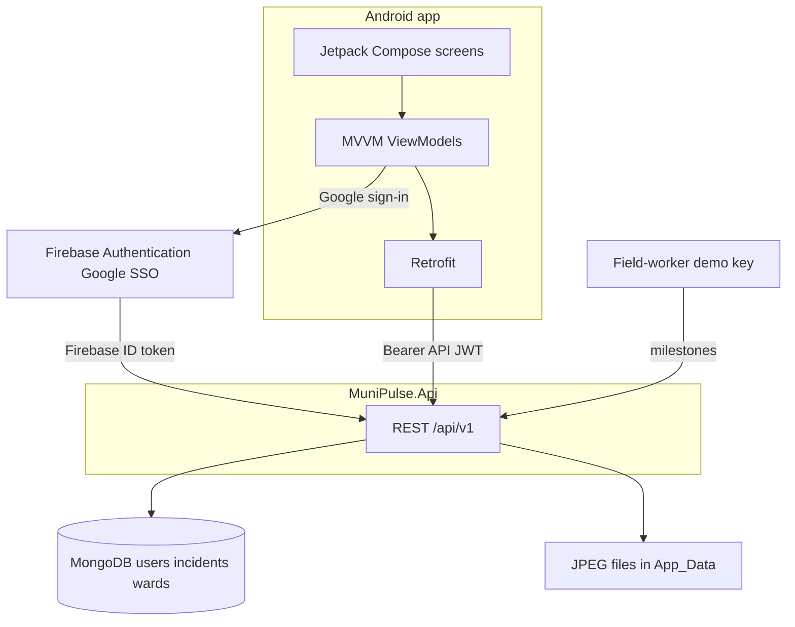

# MuniPulse SA

Citizen Service Delivery and Community Incident Tracker for South African wards. This repository is the Part 2 prototype for PROG7314 / OPSC7312, student Alton Muganda (St10263456), solo.

## Purpose

A resident signs in with Google, reports a municipal fault with a photo and a GPS fix, and sees the open reports in their ward. People upvote the same problem so it ranks as one ward signal. A field worker appends milestones, and the resident follows that timeline while online.

## Stack

| Layer | Choice |
| --- | --- |
| Android client | Kotlin, MVVM, Jetpack Compose, Coroutines and Flow, Retrofit 2 |
| Session | Firebase Authentication with Google SSO, then an HMAC API JWT in encrypted preferences |
| API | ASP.NET Core Web API on .NET 10 |
| Database | MongoDB Atlas. Collections: `users`, `incidents`, `wards` |
| Photos | JPEG multipart upload, stored by the API under `App_Data` |

## Architecture

The phone keeps UI state in ViewModels. Retrofit calls the API with the API JWT. Firebase is used only to obtain a Google ID token. `POST /api/v1/auth/session` exchanges that token for the API JWT. The API stores profiles and incidents in MongoDB and writes photo files to disk. A field worker publishes milestones with a field-worker JWT or the demo API key.



## Part 2 and Final POE

Part 2 includes Google SSO, Settings, the custom API and database, and custom features UD-1 (photo + GPS), UD-2 (upvotes and ward aggregation), and UD-3 (resolution timeline).

Final POE is not in this build: biometric unlock, Room offline sync, FCM, full English and isiZulu localisation, Azure Blob, the emergency map (UD-4), and impact scores (UD-5).

## Layout

```
android/          Jetpack Compose app (application id com.munipulse)
api/              MuniPulse.slnx and MuniPulse.Api
```

## Version control and GitHub Actions

This is one Git repository. `android/` is the Compose app and `api/` is the ASP.NET Core solution. Commit source, the Gradle wrapper, `google-services.json.example`, and `appsettings.json` with the secret fields left empty. The root `.gitignore` keeps local files out of history: `google-services.json`, `local.properties`, `appsettings.Development.json`, `App_Data/`, build output, and `CHECKLIST.md`.

Every push runs two workflows. Each job checks out the repository with read-only permission and defines no secrets.

| Workflow | File | What a push runs |
| --- | --- | --- |
| API | `.github/workflows/api.yml` | .NET 10 SDK, then `dotnet test api/MuniPulse.slnx` |
| Android | `.github/workflows/android.yml` | JDK 21, Android compile SDK 37, then `:app:testDebugUnitTest` |

The API job uses the empty MongoDB connection string and the empty JWT signing key in `appsettings.json`. The Android job copies `google-services.json.example` into the gitignored Firebase file and does not call Firebase. GitHub-hosted runners do not include the Android SDK, so that job installs platform 37. It does not start an emulator. If platform 37 is missing from the SDK manager, the Android job cannot compile.

## Setup

Keep the Atlas connection string, the JWT signing key, the field-worker demo key, and `google-services.json` on your machine. The commands below use [user-secrets](https://learn.microsoft.com/aspnet/core/security/app-secrets) for the API. You can use a gitignored `appsettings.Development.json` instead, copied from `api/MuniPulse.Api/appsettings.Development.json.example`.

### MongoDB

Create a MongoDB Atlas cluster and a database user. The API database name is `munipulse`.

```powershell
dotnet user-secrets set "MongoDb:ConnectionString" "<atlas-connection-string>" --project api/MuniPulse.Api
```

On startup the API creates indexes and seeds wards `JHB-23`, `JHB-24`, `CPT-11`, `DBN-07`, and `TSH-04`, plus the user `demo-field-worker`. With an empty connection string, `/health` still returns ok and data routes return `503 DATABASE_UNAVAILABLE`.

### JWT signing key

Session issuance needs a key of at least 32 characters.

```powershell
dotnet user-secrets set "Jwt:SigningKey" "<at-least-32-random-characters>" --project api/MuniPulse.Api
```

`Firebase:ProjectId` in `appsettings.json` is `munipulse-987ce`. It must match the Firebase project that issued the Google ID token.

### Firebase

The Android package is `com.munipulse`. `android/app/google-services.json` is gitignored. Commit `android/app/google-services.json.example` only.

1. Copy `android/app/google-services.json.example` to `android/app/google-services.json` if the downloaded file is not there yet.
2. From `android/`, run `.\gradlew.bat :app:signingReport` and register the debug SHA-1 on the Firebase Android app.
3. Enable the Google sign-in provider. That creates a Web client ID.
4. Download `google-services.json` again into `android/app/`. The file is ready for sign-in when a Web client appears under `oauth_client`.
5. Rebuild and run on a device or emulator with Google Play. Tap **Continue with Google**.

### API URL

The API http profile listens on `http://localhost:5285`. Health check: [http://localhost:5285/health](http://localhost:5285/health).

The app reads `API_BASE_URL` from `android/local.properties` (gitignored). Start from `android/local.properties.example`.

| Where the app runs | `API_BASE_URL` |
| --- | --- |
| Emulator | `http://10.0.2.2:5285/` (the default) |
| Physical phone | Your PC's LAN address, or an HTTPS tunnel |

Debug builds allow cleartext HTTP. A release build needs an `https://` URL.

### Field-worker demo path

There is no staff app. API startup seeds Firebase uid `demo-field-worker` with role `FieldWorker` once MongoDB is configured.

```powershell
dotnet user-secrets set "FieldWorker:DemoApiKey" "<long-random-demo-key>" --project api/MuniPulse.Api
```

Choose that value yourself and leave it out of git. Create an incident, copy its id, then send the milestone call in `api/MuniPulse.Api/MuniPulse.Api.http` with header `X-Demo-Api-Key`. Types are `Assigned`, `OnSite`, `Resolved`, and `Note`. A citizen API JWT on that route, without the header, receives `403 FORBIDDEN`. A missing token receives `401`.

A Development host can also accept session aliases `dev-citizen` and `dev-field-worker` when `Auth:AllowDevBypass` is true. Copy the Development example to `appsettings.Development.json`. Those aliases are refused outside Development.

## Run the API

Requires the .NET 10 SDK.

```powershell
dotnet run --project api/MuniPulse.Api --launch-profile http
```

`dotnet test api/MuniPulse.slnx` runs the API tests. They cover create validation, the 250 metre duplicate window, the field-worker demo key comparison, and unauthenticated calls. They do not need Firebase, MongoDB, or a JWT signing key. The API workflow runs the same command on every push.

Health check: [http://localhost:5285/health](http://localhost:5285/health)

```json
{ "status": "ok", "app": "MuniPulse SA" }
```

Secrets and the phone's API address are set in [Setup](#setup).

### Domain API

Routes live under `/api/v1`. Failures use the planning error envelope (`error.code`, `message`, `fields`, `correlationId`). `/health` does not need the database. Data routes return `503 DATABASE_UNAVAILABLE` until `MongoDb:ConnectionString` is set.

| Method | Path | Auth |
| --- | --- | --- |
| POST | `/api/v1/auth/session` | Firebase ID token in the body. The API checks it against Google's securetoken certificates, then returns an API JWT. |
| GET, PATCH | `/api/v1/me` | Bearer API JWT |
| POST, GET | `/api/v1/incidents` and `/api/v1/incidents/{id}` | Bearer API JWT |
| POST | `/api/v1/incidents/photos` | Bearer API JWT. Multipart JPEG files, 1 to 3, each under 5 MB. Saved under `App_Data/incident-photos` on the API machine. |
| GET | `/api/v1/incidents/photos/{id}` | Bearer API JWT. Returns that JPEG when it is still on disk. |
| GET | `/api/v1/incidents/aggregates` | Bearer API JWT. Open reports in the ward, grouped when they share an `aggregateId`. |
| GET | `/api/v1/incidents/nearby` | Bearer API JWT. Open reports in the same ward and category within 250 metres and 14 days. |
| POST | `/api/v1/incidents/{id}/upvotes` | Bearer API JWT. One vote per user. |
| POST | `/api/v1/incidents/{id}/milestones` | FieldWorker role, or header `X-Demo-Api-Key`. Appends Assigned, OnSite, Resolved, or Note and returns the timeline in time order. |

Demo wards seeded into MongoDB: `JHB-23`, `JHB-24`, `CPT-11`, `DBN-07`, `TSH-04`. Categories: `Pothole`, `WaterLeak`, `IllegalDumping`, `Streetlight`, `Sewage`, `Other`.

A Development host with `Auth:AllowDevBypass` set to true accepts `firebaseIdToken` values `dev-citizen` and `dev-field-worker` and returns an API JWT. Those aliases are refused in any other environment. See [Setup](#setup).

### Milestone without a staff app

Follow [Field-worker demo path](#field-worker-demo-path). The log records the user id. It does not record the token or the key.

A new report joins an open report in the same ward and category when it is within 250 metres and 14 days. Both then share an `aggregateId`. Otherwise `aggregateId` stays null. A stored photo's `url` is `/api/v1/incidents/photos/{id}`. Azure Blob is Final POE. Sending the same `clientMutationId` again returns `409 DUPLICATE_MUTATION` and does not create a second incident.

Sample calls are in `api/MuniPulse.Api/MuniPulse.Api.http`.

## Run the Android app

Open `android/` in Android Studio (AGP 9.4, Gradle 9.6, compile SDK 37). Studio writes `sdk.dir` into `android/local.properties`. Set `API_BASE_URL` as described in [API URL](#api-url).

From `android/`, `.\gradlew.bat :app:testDebugUnitTest` runs the incident form validator tests. Those tests do not need Firebase, MongoDB, or a device. The Android workflow runs the same task on every push.

### Google sign-in

The login screen (S03) uses Firebase Authentication. The Google services plugin is `com.google.gms.google-services` 4.5.0. It is declared in `android/build.gradle.kts` and applied in `android/app/build.gradle.kts`. The Firebase BoM is 34.19.0.

Follow [Firebase](#firebase), then tap **Continue with Google**.

After Google sign-in, the app sends the Firebase ID token to `POST /api/v1/auth/session`. The API JWT is stored in encrypted preferences and removed on sign-out. A later launch reuses it until it expires. Logs record the Firebase uid, the API user id, the HTTP method, path, status, and correlation id. They record an exception type when something fails. They do not record the Firebase ID token, the API JWT, the Authorization header, or a MongoDB connection string.

Cold start stays on the splash while that session is checked. A valid session opens Home. With no session, first launch shows three onboarding pages (photo and GPS, crowd-rank, milestones), then the Google sign-in screen. Sign-out returns to sign-in and does not show those pages again.

Home is the ward pulse. It shows the default ward, a count of open incidents in that ward, and each open report as a category, a short place line, and an upvote count. **Report** is on that screen, so a signed-in person reaches it in one tap. The ward menu uses the same five demo wards. The bell opens notification preferences and the profile icon opens Profile. The bottom bar has Home, My, Map, and Settings. Map stays on the bar, stays disabled, and is labelled Final POE. It does not open a screen. **Ward hotspots** opens from Home and calls `GET /api/v1/incidents/aggregates`. Each row is one server group: same ward, same category, within 250 metres, and reported in the last 14 days. The row shows the report count and the upvote total, and opens the highest-voted report in that group. A grouped report says so on its detail screen. **My** lists this account's reports from `GET /api/v1/incidents?scope=mine`, with a filter for all, submitted, in progress, or resolved. An empty ward list, an empty My list, and a failed load each explain what happened. Empty lists offer **Report**. A failed load offers **Retry**. A row on Home or My opens the incident: status, description, photos, upvote count, and the timeline from oldest to newest. Each event shows the type, time, role, and note. **Refresh** loads that incident again, so a milestone posted while the screen is open appears without leaving the page. **Upvote** adds one vote for the signed-in person. The count and **You upvoted** show on the detail screen, the ward pulse, and My incidents. A second vote returns `409 ALREADY_UPVOTED` and does not increase the count. Creating a report already counts as that person's vote. The live map is not on that screen yet. The pulse calls `GET /api/v1/incidents?scope=ward`. Detail calls `GET /api/v1/incidents/{id}`. Logcat records the ward code and how many open incidents loaded, or an error code. It does not record coordinates or the description. Settings, opened from that bar, shows the display name, a masked email, and the default ward (JHB-23, JHB-24, CPT-11, DBN-07, TSH-04). Sign out is on Settings.

When a session exists, the app calls `GET /api/v1/me`. Changing the ward or ticket-status and area-emergency switches calls `PATCH /api/v1/me`. Marketing and news stay on the device and are not sent. If the API is unreachable, the change stays local and Settings says so. The next successful sync sends that change. Preferred language is read and written with the profile (`en` or `zu`) and is not shown as its own screen yet.

Settings opens notification preferences: ticket status and area emergencies start on, and marketing and news start off. Those three choices stay on the device. Push delivery is Final POE and is not implemented.

Language, biometric unlock, and the sync centre are visible on Settings and marked **Coming in Final POE**. They do not open a language picker, a fingerprint prompt, or an offline queue.

Settings includes a POPIA-style privacy note: name, email, ward, location, and photos are kept only for this demo, and location and photos are used to report a fault.

Settings opens Profile. That screen shows the name, masked email, default ward, language, and role. Impact score and badges are marked **Coming in Final POE** and are not shown.

Home opens **New incident**. The form has a category (pothole, water leak, illegal dumping, streetlight, sewage, or other), a description, up to three photo previews from the camera or gallery, and a GPS line with **Refresh GPS**. Denying camera, gallery, or location stays on the screen and does not close the app. **Submit report** checks the category, a description of 10 to 1000 characters, a latitude and longitude, accuracy when a fix has one, the default ward, and a maximum of three photos. Invalid input stays on the screen. When a location is set, the form asks `GET /api/v1/incidents/nearby` and can expand **Nearby duplicates** with the category, a short place line, the upvote count, and the distance. A valid form uploads the photos as JPEG multipart, then `POST /api/v1/incidents` with a stable `clientMutationId`. A retry of that same form returns the already-submitted message instead of a second row. Logcat records permission results, create success or failure, and the accuracy in metres. It does not record the coordinates, the description, or a token.

Protected API routes require that bearer token. A missing token returns `401 UNAUTHENTICATED`. An invalid or expired token returns `401 INVALID_TOKEN`.

The SDK used for the scaffold compile is `%LOCALAPPDATA%\Android\Sdk` (platform 37). `android/local.properties` is generated locally and gitignored. `ANDROID_HOME` does not need to be set when that file contains `sdk.dir`.

## Still to come

Screenshots and the unlisted demo video link are added in milestone M9.

**Demo video: TBD**
